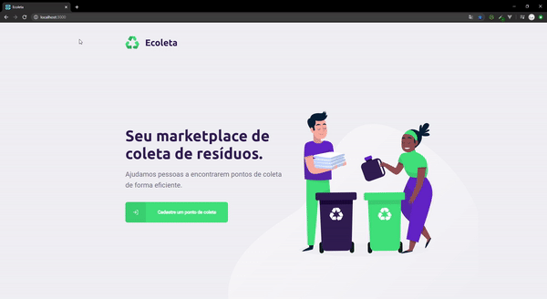

<h3 align="center">
    
    <br><br>
    <b>Ecoleta, Waste Recycling</b>  
    <br>
</h3>

<p align="center">
  <a href="https://rocketseat.com.br">
    
  </a>
</p>

## 📋 About

Ecoleta, is a web application and mobile for register waste collect points and search points for waste collect. 

In <b>Web</b>, it is possible register waste collect points and add image, your waste items and add your location in map.

In <b>Mobile</b>, it is possible search waste collect points by city, uf and filter waste items in map. In details collect points it is possible send e-mail and whatsapp. 

## 🤷🏻‍♀️ How to run the project?

- Install depencies for server and run:

```sh
  cd server
  npm install
  npm run knex:migrate
  npm run knex:seed
  npm run dev
```

- Install depencies for web and run:

```sh
  cd web
  npm install
  npm start
```

- Install depencies for mobile and run:

```sh
  cd mobile
  yarn
  yarn start
```

## 🛰 Used Technologies and Libs

In <b>server</b>:
- [TypeScript](https://www.typescriptlang.org/)
- [Node.js](https://nodejs.org/en/)
- [Express](https://expressjs.com/pt-br/)
- [Multer](https://github.com/expressjs/multer)

In <b>web</b>:
- [TypeScript](https://www.typescriptlang.org/)
- [ReactJS](https://reactjs.org/)
- [React Dropzone](https://github.com/react-dropzone/react-dropzone)
- [React Leadflet](https://react-leaflet.js.org/)

In <b>mobile</b>
- [React Native](https://reactnative.dev/)
- [React Native Maps](https://www.npmjs.com/package/react-native-maps)
- [React Native Navigation](https://reactnavigation.org/)

## 📈 Result

- The layout developed for [Rocketseat](https://reactnative.dev/) is available in [Figma](https://www.figma.com/file/1SxgOMojOB2zYT0Mdk28lB/);

<h1 align="center">
    
</h1>

<h4 align="center">
    Developed with 💜 by <a href="https://www.linkedin.com/in/lu%C3%ADs-gustavo-burigo-alexandre-479202158/" target="_blank">Luís Gustavo Búrigo Alexandre</a>
</h4>
